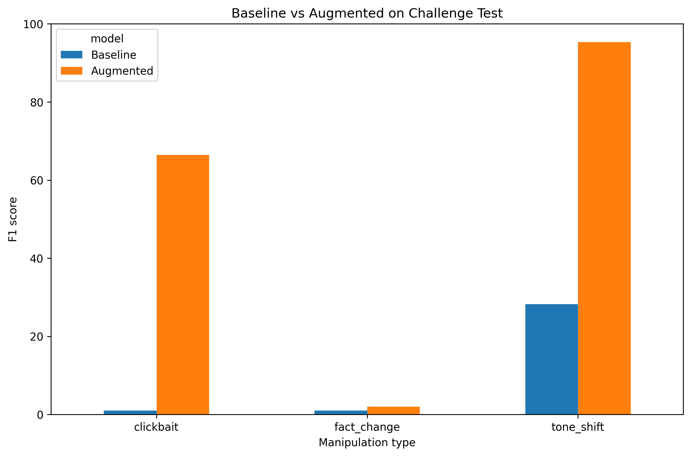

# Synthetic News Generation and Detection

Generating synthetic news using LLMs and analyzing their impact on manipulated news detection.

## Project Description

The goal of this project is to investigate whether LLM-generated data augmentation can improve the detection of manipulated news.

Two models are compared:

- **Baseline model** – trained only on the original data
- **Augmented model** – trained on the original and synthetically generated data

Both models use the same classification approach:

- word-level TF-IDF
- character-level TF-IDF
- LinearSVC

Three types of manipulation are considered:

- `fact_change` – changing one factual detail
- `clickbait` – changing the headline to make it more attention-grabbing
- `tone_shift` – changing the tone of the text while preserving the underlying facts

`gemini-3.5-flash-lite` is used to generate synthetic training data, while the challenge test is generated using `gemini-3.5-flash`. Using a different model for the challenge test reduces the possibility that the augmented detector is evaluated only on the specific generation style seen during training.

## Data

The ISOT Fake News Dataset is used, which contains:

- `True.csv` – real news
- `Fake.csv` – fake news

After cleaning, the data is split into:

- 80% training data
- 20% test data

Synthetic training data is generated only from real news articles from the training set, while the challenge test is created from real news articles from the test set.

The `Fake.csv` and `True.csv` files are not included in the repository. They need to be downloaded from Kaggle and placed in:

```text
data/raw/
```

## Project Structure

```text
synthetic-news-generation-and-detection/
│
├── data/
│   ├── raw/
│   │   └── README.md
│   │
│   └── processed/
│       ├── test.csv
│       ├── synthetic_train.csv
│       └── challenge_test.csv
│
├── models/
│   ├── baseline_model.joblib
│   └── augmented_model.joblib
│
├── notebooks/
│   ├── 01_data_preparation.ipynb
│   ├── 02_synthetic_generation.ipynb
│   └── 03_training_evaluation.ipynb
│
├── results/
│   ├── challenge_metrics.csv
│   └── figures/
│       └── challenge_comparison.png
│
├── src/
│   ├── __init__.py
│   ├── preprocessing.py
│   ├── generation.py
│   ├── modeling.py
│   └── evaluation.py
│
├── .gitignore
├── README.md
└── requirements.txt
```

The `train.csv` and `augmented_train.csv` files exist locally while working on the project, but they are not included in the GitHub repository because of their size (> 100 MB).

## Running the Project

The project should be opened from the main `synthetic-news-generation-and-detection` directory.

### 1. Installing Libraries

Run the following command in the terminal:

```bash
pip install -r requirements.txt
```

### 2. Input Data

Download the ISOT Fake News Dataset and place the `Fake.csv` and `True.csv` files in:

```text
data/raw/
```

### 3. Gemini API Key

If the synthetic data is generated again, a `.env` file needs to be created in the main project directory:

```text
GEMINI_API_KEY=your_api_key
```

The `.env` file is not included in the Git repository.

### 4. Running the Notebooks

The notebooks should be run in the following order:

```text
01_data_preparation.ipynb
02_synthetic_generation.ipynb
03_training_evaluation.ipynb
```

#### `01_data_preparation.ipynb`

Loads `Fake.csv` and `True.csv`, cleans the data, assigns labels, and splits the data into training and test sets.

The following files are created:

```text
data/processed/train.csv
data/processed/test.csv
```

#### `02_synthetic_generation.ipynb`

Synthetic manipulations are generated from real news articles from the training set using an LLM.

The following files are created:

```text
data/processed/synthetic_train.csv
data/processed/augmented_train.csv
data/processed/challenge_test.csv
```

The challenge test is generated from real news articles from the test set using a different LLM model.

#### `03_training_evaluation.ipynb`

The Baseline model is trained on `train.csv`, while the Augmented model is trained on `augmented_train.csv`.

The models are saved in:

```text
models/baseline_model.joblib
models/augmented_model.joblib
```

Both models are evaluated separately on three challenge test manipulation types:

- `fact_change`
- `clickbait`
- `tone_shift`

Accuracy, Precision, Recall, and F1-score are calculated.

The results are saved in:

```text
results/challenge_metrics.csv
results/figures/challenge_comparison.png
```

## Running Without Regenerating LLM Data and Retraining

The repository already contains `synthetic_train.csv`, `challenge_test.csv`, the trained models, and the final results. Therefore, it is not necessary to call Gemini again or retrain the models to view the results and rerun the evaluation.

In `02_synthetic_generation.ipynb`, the already generated data can be loaded:

```python
synthetic_train = pd.read_csv(
    "data/processed/synthetic_train.csv"
)

challenge_test = pd.read_csv(
    "data/processed/challenge_test.csv"
)
```

In this case, the cells that call:

```python
generate_synthetic_dataset(...)
```

should not be run.

In `03_training_evaluation.ipynb`, the saved models can be loaded using:

```python
baseline_model = joblib.load(
    "models/baseline_model.joblib"
)

augmented_model = joblib.load(
    "models/augmented_model.joblib"
)
```

In this case, it is not necessary to run:

```python
baseline_model.fit(...)
augmented_model.fit(...)
```

After loading the saved models, the evaluation can be run again, the metrics can be calculated, and the results graph can be generated.

## Results

| Manipulation Type | Baseline F1 | Augmented F1 | Improvement |
|---|---:|---:|---:|
| Clickbait | 0.99% | 66.45% | +65.46 pp |
| Fact change | 0.99% | 1.97% | +0.98 pp |
| Tone shift | 28.21% | 95.31% | +67.11 pp |

The augmented model shows a substantial improvement for `clickbait` and `tone_shift` manipulations. For `fact_change`, the improvement is much smaller because only one factual detail is modified while most of the article remains unchanged.

### F1 Score Comparison



The figure compares the F1 scores of the Baseline and Augmented models across all three manipulation types.

## Note on Large Files

The `train.csv` and `augmented_train.csv` files are not included in the repository because they are larger than 100 MB.

They can be recreated by running the corresponding notebooks.